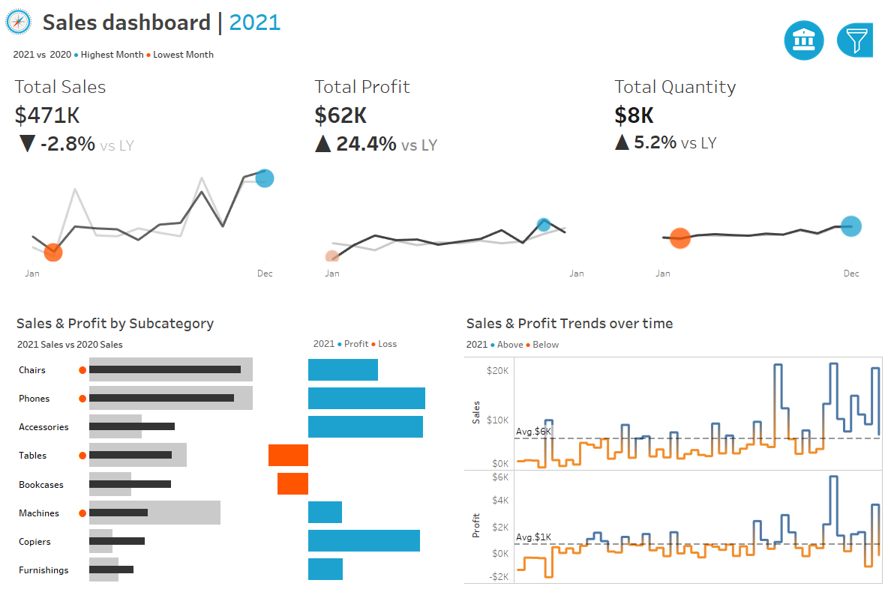

# Fajfar's Porfolio
# This will be my main repository where i will be adding all the upcoming projects.

## Project 1. Sales dashboard made in Tableau

This is my first project that I have made in Tableau. Using 4 .csv files I have made a Sales dashboard where users can see the amount of Total Sales, Profits and Quantity made from 2020 to 2023.
The project itself contains 7 sheets (KPI Sheets, Subcategory and Weekly Trends) and 1 dashboard where i visualized all the charts that I've made.
It is also possible to filter these charts by Categories and Location. Using the Select Year Parameter you can switch between the years.

